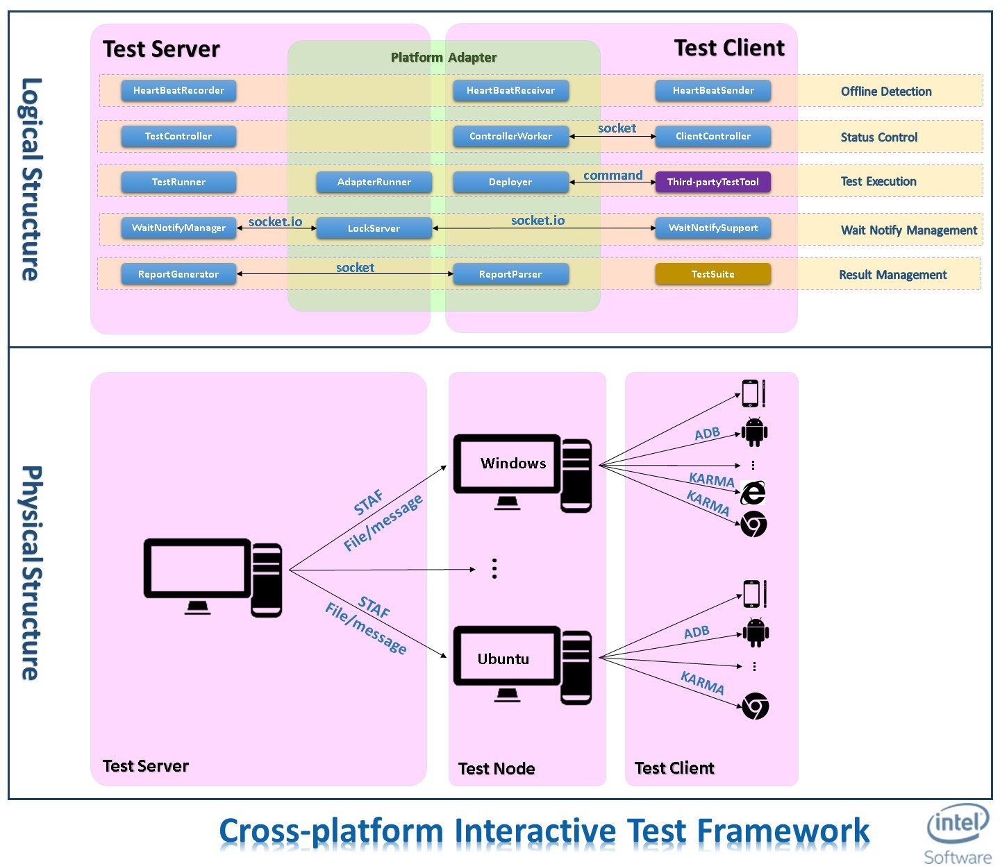

The Intel Interactive Test Framework
===============================
# Introduction {#section1}
This Interactive Test Framework is mainly to direct cross-platform white-box testing for the Intel CS for WebRTC client SDK.
Different from traditional test tools, the test roles can be deployed under different OS and different platform(currently, Android, Chrome and IE are supported).

The advantages of this framework are as followings:
    + **Cross-platform**: In particular occasions, we have to test on devices under different platforms and they may have a squence of interactive operations. Though we can employee mock things to do the testing, it cannot reflect the real circumstance.
    + **Minimize Code Labor**: The test code is divided into test roles and combined into test case according to the test method name. So the code can be reused event other roles in this test case changes to another platform.
    + **Wait-Notify Machanism**: In order to control the execution order under different platforms, we implement a cross-platform lock events and wait-notify machanism.

# Architecture {#section2}
The following figure shows the architecture of this framework.

## Logical Structure {#section2_1}

1. **Offline Detection**: Employ heartbeat mechanism to detect whether the test devices are offline.
    + HeartBeatRecorder: Manage the received heart beat messages from all test clients automatically.
    + HeartBeatReceiver: Run on distributed test node, collect heartbeat from test device and send to test server.
    + HeartBeatSender: Run on test device, Start a thread that regularly sends heart beat messages to server.
2. **Status Control**: Send device test status and messages according to message protocol
    + TestController: Communicate with ClientController, mainly collect device test status (and  other messages).
    + ControllerWorker: Receive the messages from ClientController on all the devices of that test node.
    + ClientController: Send out device test status and messages
3. **Test Executing**: Manage the executing, mainly utilizing the OS and third-party test tools
    + TestRunner: Control the test process . Utilizing the RunnerHelper in different platform to deploy test start test and access the third-party test tools. Managing the LockServer to pass lock between test server and test devices. Collecting the test result for the TestSuite.
    + AdapterRunner: For one specific platform, help TestRunner to direct the test execution. Help clean the test environment , start a test on a device and return the running environment.
    + Deployer: Wrapper of third-party test tool that deploy test case on device and start test on that single platform test tool.
    + Third-party Test Tool:  Android instrumentation & karma for javascript.
4. **Wait Notify Management**: Implement a  cross-platform wait-notify mechanism between all the test devices.
    + WaitNotifyManager: Be responsible for the management of the remote wait-notify mechanism. Maintain the waiting list &notify list and send wait-notify messages to testdevices.
    + LockServer: passing locking message between WaitNotifyManager and local WaitNotifySupport with socket.io, in order to unify the communication between  the two component and reduce the relatedness to specific platform.
    + WaitNotifySupport: Mainly wrap local wait-notify operations on test device.
5. **Result Management**: report the result of given TestSuite from user.
    + ReportGenerator: generate the test result of TestSuite after all TestCase s have done.
    + ReportParser: Send all the device results on test node to TestServer.
    + TestSuite: User defined test logic.

## Physical Structure {#section2_2}

1. **Test Server**
    + Runs the server side logic of  test framework
    + Send deploy files or command to distributed test nodes by STAF framework
2. **Test Node**
    + Distributed host computers of physical test devices(browsers or android phones)
    + Directly manage the devices and call the third-party test tools
    + Intermediate communication component between test server and test devices
3. **Test Client**
    + Executing devices of TestCases.

# Test Sample Guide {#section3}
The test framework is an java project, in order to run the sample test:

1. Update android project to change some environment params.
    + cd 'TestFramework'(Framework project)
    + Run "android update project -p ."
    + cd 'TestFrameworkTest'(Test project for framework).
    + Run "android update project -p ."

2. Modify the config file: 'test.cfg' under 'TestFramework'.

3. Import 'TestFramework' and 'TestFrameworkTest' as existing android project.

4. Import BaseSDK & P2PSDK under repo 'webrtc-android-sdk' and setting project dependency.

5. Change the 'Bootstrap Entries' of test entry:

    + Entries(path: TestFrameworkTest.com.intel.webrtc.test.p2ptest):
        + jsp2pMain: js-to-js p2p test
        + P2PJS2Android: js-to-android p2p test
        + P2PMain: android-to-android p2p test
    + Right click one of the 3 entries in eclipse -> Run as(java application) -> Run Configurations -> Classpath -> BootstrapEntries -> Advanced -> Add Library -> JRE System Library
    + Move up the added JRE lib before android lib in 'Bootstrap Entries'.

6. Build project: 
Build BaseSDK -> Build P2PSDK -> Build TestFramework -> copy 'TestFramework/bin/testframework-android.jar' to 'TestFrameworkTest/libs' -> Build 'TestFrameworkTest'

7. Right click on the test entry class and run as java application.

# Write Customized Test Guide{#section4}
1. Create android project and import 'TestFramework/bin/testframework-android.jar', 'hamcrest-core-1.3.jar' and 'junit-4.12.jar'

2. Modify 'AndroidManifest' file(refer to uses-permission in TestFrameworkTest/AndroidManifest.xml)

3. TestCase: group test devices with the same function name as a single case. All the test functions should start with prefix 'test'.
        + Android: extend AndroidTestDevice, calling waitForObject(String lock) and notifyObject(String lock) to achieve wait-notify locally.
        + JS: write jasmine test case, refer to the instruction under 'webrtc-javascript-sdk/test/p2pInteractionTest', init JavascriptTestDevice with karma config file and test case file.
        + Main logic: Create TestDevice on your target platform -> addTestDevice to TestSuite -> Init TestRunner with Config and TestSuite -> runTestSuite.

