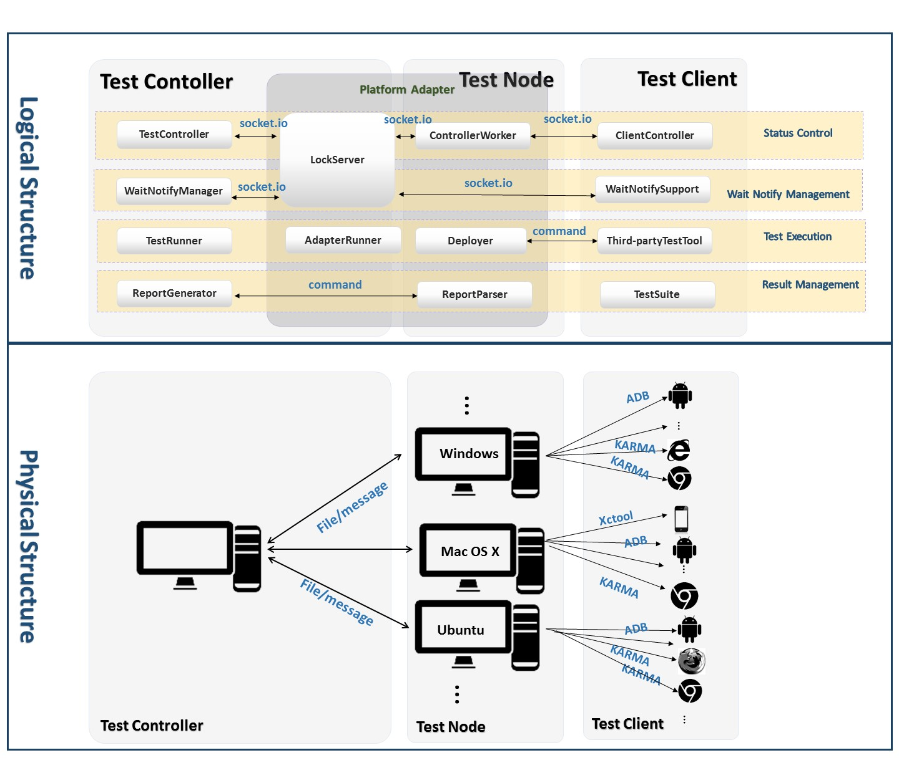

# IATF - Interactive API Testing Framework

## Introduction

IATF is a test framework handles cross-platform and multi-device API test automation.

Links: [Video](https://youtu.be/mHJspt6BgZU?list=PLSIUOFhnxEiAeGHYoBZCvEMY5wCOIpyOM), [Slides](https://docs.google.com/presentation/d/1iVf-TogkdoIcvs8OpRMMWx76s9Zk4_f0JJ-e1sZIxog/edit#slide=id.p490)

Different from traditional test tools, the test roles can be deployed under different OSes and different platforms.

The advantages of this framework are as followings:

- **Cross-platform**: In particular occasions, we have to test on devices under different platforms and they may follow a specific sequence of interactive operations. Though we can employee mock things to do the testing, it cannot reflect the real circumstance.
- **Minimize Code Labor**: The test code is divided into test roles and combined into test case according to the test method name. So the code can be reused event other roles in this test case changes to another platform.
- **Wait-Notify Mechanism**: In order to control the execution order under different platforms, we implement a cross-platform lock events and wait-notify mechanism.

## Architecture

The following figure shows the architecture of this framework.


### Logical Structure

In this section, we present our design to address the aforementioned problems via four corresponding components of IATF logical structure: Status Control, Test Execution, Wait Notify Management and Result Management.

1. **Status Control**: It is used to monitor device status during testing and Sends device test status and messages according to the message protocol.
    + TestController: Communicates with ClientController, mainly collects device test status, and dispatches the start case running or stop case running messages. Manages the received heartbeat messages from all test clients automatically.
    + ControllerWorker: Receives the messages from ClientController on all the devices of that test node. Collects heartbeats from test devices and sends them to the test controller
    + ClientController: Runs on test devices, sends out device test status and messages
2. **Wait Notify Management**: Implements a cross-platform wait-notify mechanism across all the test devices.
    + WaitNotifyManager: Responsible for the management of the remote wait-notify mechanism. Maintains the waiting list &notify list and sends wait-notify messages to test devices.
    + LockServer: Passes locking message between WaitNotifyManager and local WaitNotifySupport with Socket.IO, in order to unify the communication between the two components and reduce the dependence on specific platforms.
    + WaitNotifySupport: Mainly wraps local wait-notify operations on test devices.
3. **Test Execution**: It is responsible for the test process control and third-party test framework integration.
    + TestRunner: Controls the test process and utilizes the RunnerHelper on different platforms to deploy test cases, interacts with third-party test tools. It manages the LockServer (described in the component of Wait Notify Management) to transfer lock messages between the test controller and test devices. It also collects the test result for the TestSuite.
    + AdapterRunner: For one specific platform, helps TestRunner to direct the test execution. Helps clean the test environment, start a test on a device and return the running environment.
    + Deployer: Utilizes the third-party test tool to deploy test cases on single de-vice and start testing.
    + Third-party Test Tool: Existing single platform API testing framework.
4. **Result Management**: analyzes test result and generates test report to tester. <TODO>
    + ReportGenerator: Generates the test result of TestSuite after all test cases have been done.
    + ReportParser: Sends all the device results on test node to TestServer.
    + TestSuite: User defined test cases.

## Physical Structure

1. **Test Server**: The test server is the master of the whole test framework. It is responsible for whole system’s logic control as well as the state maintenance, e.g. whether the client is alive or dead, currently running cases, etc.
    + Runs the server side logic of  test framework
    + Send deploy files or command to distributed test nodes.
2. **Test Node**: The test nodes are the host computers which manage the physical test devices. They work as the middle layer between the test controller and test clients.
    + Distributed host computers of physical test devices(e.g browsers,Android platforms or iOS platfroms etc)
    + Directly manage the devices and call the third-party test tools
    + Intermediate communication component between test server and test devices
3. **Test Client**: The test clients are the SUT (system under testing) on which the test cases with corresponding third-party API test framework are executed. They are deployed on top of different platforms for different types of API testing.

## Sample with JavaScript client

A sample is included to demostrate how to add and run a task for two web endpoints. Task info will be uploaded by a REST request, and both test devices will be launched by controller and WebDriver.

1. Install dependence and start IATF server.
   + Install node module
   ```
   cd src/server/
   npm install
   ```
   + Start IATF Server

   ```
   node src/server/server.js --certificate_file <cert> --key_file <key>
   ```

2. Host test pages.

As current sample is a html page, you'll need a web server to host it and its resources. If you don't have such a web server, http-server might be a choice for development or evaluation. Simplely install it by `npm install -g http-server`. Then `http-server src\client`. It will listen HTTP request on 8081 port because the default 8080 is occupied by IATF server.

3. Add a task to IATF server by a REST request (PUT) to `https://<server>/rest/v1/tasks`. An example could be
```
{
    "roles": [{
        "name": "role1",
        "type": "JavaScript",
        "config":{"url":"http://localhost:8081/javascript/test.html"}
    },{
        "name": "role2",
        "type": "JavaScript",
        "config":{"url":"http://localhost:8081/javascript/test.html"}
    }]
}
```
4. Install prerequisite software for test client.
   + Install the browsers you would like to test, available for your machine. Chrome, Edge, Firefox and Safari are supported at this stage. See the wiki for some limitations or hints for each browser
   + Install webdriver,download the corresponding webdrivers for your tested browser.
   + Modify webdriver installation path in src/controller/runners/javascriptrunner.py.

5. Start client controller.
```
python src/controller/controller.py --server https://localhost:8080 --no_ssl_verification --task <taskId>
```